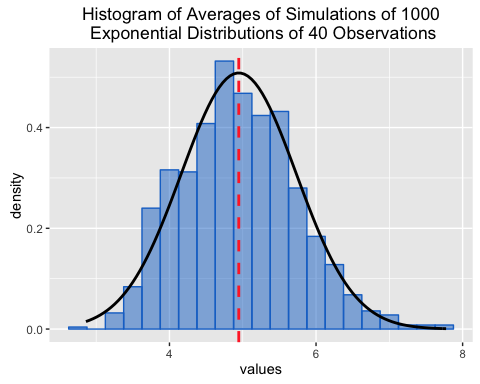

# Comparing the Exponential Distribution With The Central Limit Theorem
Daniel Chacon  
11/22/2016  


##Overview
In this investigation we analyzed the exponential distribution by comparing it with the CLT (Central Limit Theorem). With the results from many simulations we compared them with theorical results and we saw that they were very aproximate to the theory. 

##Simulations
First it's important to set the variables:

1. Lambda ($\lambda$): needed for simulations and theorical calculations, for this investigation was set to 0.2
2. n: number of observations, set to 40 exponential observations
3. nSim: the number of simulations was set to 1000.

This variables will help us across the investigation.

```r
lambda <- 0.2
n <- 40
nSim <- 1000
```

Then we begin to create the 1000 simulations and save the mean of each one of them in a array so we can analyze the distribution of the samples and compare them with the theorical calculations.

```r
avgMeans <- NULL
for (i in 1 : nSim) {
    sim <- rexp(n,lambda)
    currentAvg <- mean(sim)
    avgMeans <- rbind(avgMeans,currentAvg)
}
```

##Sample versus Theory
With this simulations we know that the distribution of this data thanks to the CLT. The distribution follows the Normal distribution with the following mean and variance:
$$\bar X_n \sim N \left(\mu,\frac{\sigma^2}{n}\right)$$
As we know the $\mu$ of an exponential distribution is equal to $\frac{1}{\lambda}$, so we can say that the mean of the distribution of averages is:  
$$\mu = \frac{1}{\lambda}$$
And for the $\sigma^2$, we also know that is equal to $\left(\frac{1}{\lambda}\right)^2$ but in this case we need to devide between $n$ because of the CLT so the formula of the variance must be the following:
$$\sigma^2=\frac{\left(\frac{1}{\lambda}\right)^2}{n}$$

###Mean
We calculate the mean of the distribution of averages with the mean function and save it in a variable that we are going to use later.

```r
observedMean <- mean(avgMeans)
observedMean
```

```
## [1] 4.945732
```
And also calculate the expected mean to compare it with the observed.

```r
1/lambda
```

```
## [1] 5
```
As we can see the observed mean is almost the expected mean only with a difference of decimals.

###Variance
We also use the `var` function to calculate the observed variance.

```r
var(avgMeans)[1]
```

```
## [1] 0.6156204
```
And also calculate the expected variance (the formula used is $\frac{\left(\frac{1}{\lambda}\right)^2}{n}$ ) to compare it with the observed.

```r
(1/lambda)^2/n
```

```
## [1] 0.625
```
The results from this data says to us that the difference is only of decimals also.

###Standard Deviation
We are also calculating the standard deviation because we need this data for later.

```r
observedSD <- sd(avgMeans)
observedSD
```

```
## [1] 0.7846148
```
In the case of the expected standard deviation we only calculate the square root of the variance.
$$\sigma=\sqrt\frac{\left(\frac{1}{\lambda}\right)^2}{n}$$

```r
sqrt((1/lambda)^2/n)
```

```
## [1] 0.7905694
```
The difference is also of decimals.
 
##Distribution
To see in a more graphic way first we need to create a data frame with the information

```r
dat <- data.frame(values = avgMeans)
```


```r
library(ggplot2)
g <- ggplot(dat, aes(x = values)) 
g <- g + geom_histogram(alpha = .50, binwidth=0.25,fill="dodgerblue3", colour= "dodgerblue3", aes(y = ..density..))
g <- g + stat_function(fun = dnorm, args = list(mean=observedMean,sd=observedSD), colour="black", size= 1)
g <- g + geom_vline(xintercept = observedMean,show.legend = TRUE,colour="firebrick1", size=1,linetype=2)
g <- g + ggtitle("Histogram of Averages of Simulations of 1000\n Exponential Distributions of 40 Observations")
print(g)
```


As we can see the observed data follows a normal distribution almost as the expected results (only a difference of decimals).
