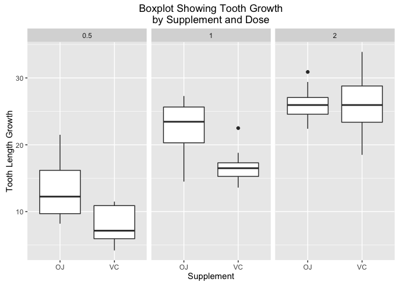

# Comparing Tooth Growth Between Supplements
Daniel Chacon  
11/27/2016  


##Load ToothGrowth Dataset

```r
library(datasets)
library(ggplot2)
data("ToothGrowth")
```
##Basic exploratory data analyses

```r
str(ToothGrowth)
```

```
## 'data.frame':	60 obs. of  3 variables:
##  $ len : num  4.2 11.5 7.3 5.8 6.4 10 11.2 11.2 5.2 7 ...
##  $ supp: Factor w/ 2 levels "OJ","VC": 2 2 2 2 2 2 2 2 2 2 ...
##  $ dose: num  0.5 0.5 0.5 0.5 0.5 0.5 0.5 0.5 0.5 0.5 ...
```

```r
head(ToothGrowth)
```

```
##    len supp dose
## 1  4.2   VC  0.5
## 2 11.5   VC  0.5
## 3  7.3   VC  0.5
## 4  5.8   VC  0.5
## 5  6.4   VC  0.5
## 6 10.0   VC  0.5
```

```r
tail(ToothGrowth)
```

```
##     len supp dose
## 55 24.8   OJ    2
## 56 30.9   OJ    2
## 57 26.4   OJ    2
## 58 27.3   OJ    2
## 59 29.4   OJ    2
## 60 23.0   OJ    2
```

```r
unique(ToothGrowth$dose)
```

```
## [1] 0.5 1.0 2.0
```

```r
g <- ggplot(ToothGrowth, aes(supp,len))
g <- g + geom_boxplot()
g <- g + facet_wrap(~dose)
g <- g + ggtitle("Boxplot Showing Tooth Growth\nby Supplement and Dose")
g <- g + xlab("Supplement")
g <- g + ylab("Tooth Length Growth")
print(g)
```



##Basic summary of the data

```r
summary(ToothGrowth)
```

```
##       len        supp         dose      
##  Min.   : 4.20   OJ:30   Min.   :0.500  
##  1st Qu.:13.07   VC:30   1st Qu.:0.500  
##  Median :19.25           Median :1.000  
##  Mean   :18.81           Mean   :1.167  
##  3rd Qu.:25.27           3rd Qu.:2.000  
##  Max.   :33.90           Max.   :2.000
```
##Hypothesis Tests
We are going to perform 4 Hypothesis Tests with the information we observed in the data exploratory analysis:

1. Prove that the mean of `VC` supplement is equal to the mean of `OJ` supplement

$$H_0:\mu_{VC}=\mu_{OJ}\sim\mu_{VC}-\mu_{OJ}=0$$
$$H_a:\mu_{VC}\neq\mu_{OJ}\sim\mu_{VC}-\mu_{OJ}\neq0$$


```r
ojDose <- ToothGrowth[ToothGrowth$supp=="OJ",1]
vcDose <- ToothGrowth[ToothGrowth$supp=="VC",1]
htest <- t.test(vcDose,ojDose)
htest
```

```
## 
## 	Welch Two Sample t-test
## 
## data:  vcDose and ojDose
## t = -1.9153, df = 55.309, p-value = 0.06063
## alternative hypothesis: true difference in means is not equal to 0
## 95 percent confidence interval:
##  -7.5710156  0.1710156
## sample estimates:
## mean of x mean of y 
##  16.96333  20.66333
```
Result: with p value of 6.06% greater than 5%, and the $\mu=0$ is between the limits of the confidence interval [-7.57,0.17] we can't reject the hypothesis $H_0$.

2. Prove that the mean of `VC` supplement with a dose of 0.5 greater than the mean of `OJ` supplement with a dose of 0.5

$$H_0:\mu_{VC}>\mu_{OJ}\sim\mu_{VC}-\mu_{OJ}>0$$
$$H_a:\mu_{VC}\leq\mu_{Oj}\sim\mu_{VC}-\mu_{OJ}\leq0$$


```r
ojDose <- ToothGrowth[ToothGrowth$supp=="OJ" & ToothGrowth$dose==0.5,1]
vcDose <- ToothGrowth[ToothGrowth$supp=="VC" & ToothGrowth$dose==0.5,1]
htest<-t.test(vcDose,ojDose,alternative = "less")
htest
```

```
## 
## 	Welch Two Sample t-test
## 
## data:  vcDose and ojDose
## t = -3.1697, df = 14.969, p-value = 0.003179
## alternative hypothesis: true difference in means is less than 0
## 95 percent confidence interval:
##      -Inf -2.34604
## sample estimates:
## mean of x mean of y 
##      7.98     13.23
```
Result: with p value of 0.32% lower than 5%, and the $\mu=0$ is not between the limits of the confidence interval [-Inf,-2.35] we can reject $H_0$.

3. Prove that the mean of `VC` supplement with a dose of 1 greater than the mean of `OJ` supplement with a dose of 1

$$H_0:\mu_{VC}>\mu_{OJ}\sim\mu_{VC}-\mu_{OJ}>0$$
$$H_a:\mu_{VC}\leq\mu_{Oj}\sim\mu_{VC}-\mu_{OJ}\leq0$$


```r
ojDose <- ToothGrowth[ToothGrowth$supp=="OJ" & ToothGrowth$dose==1.0,1]
vcDose <- ToothGrowth[ToothGrowth$supp=="VC" & ToothGrowth$dose==1.0,1]
htest <- t.test(vcDose,ojDose,alternative = "less")
htest
```

```
## 
## 	Welch Two Sample t-test
## 
## data:  vcDose and ojDose
## t = -4.0328, df = 15.358, p-value = 0.0005192
## alternative hypothesis: true difference in means is less than 0
## 95 percent confidence interval:
##       -Inf -3.356158
## sample estimates:
## mean of x mean of y 
##     16.77     22.70
```
Result: with p value of 0.05% lower than 5%, and the $\mu=0$ is not between the limits of the confidence interval [-Inf,-3.36] we can reject $H_0$.

4. Prove that the mean of `VC` supplement with a dose of 2 equal to the mean of `OJ` supplement with a dose of 1

$$H_0:\mu_{VC}=\mu_{OJ}\sim\mu_{VC}-\mu_{OJ}=0$$
$$H_a:\mu_{VC}\neq\mu_{Oj}\sim\mu_{VC}-\mu_{OJ}\neq0$$


```r
ojDose <- ToothGrowth[ToothGrowth$supp=="OJ" & ToothGrowth$dose==2.0,1]
vcDose <- ToothGrowth[ToothGrowth$supp=="VC" & ToothGrowth$dose==2.0,1]
htest <- t.test(vcDose,ojDose)
htest
```

```
## 
## 	Welch Two Sample t-test
## 
## data:  vcDose and ojDose
## t = 0.046136, df = 14.04, p-value = 0.9639
## alternative hypothesis: true difference in means is not equal to 0
## 95 percent confidence interval:
##  -3.63807  3.79807
## sample estimates:
## mean of x mean of y 
##     26.14     26.06
```
Result: with p value of 96.39% greater than 5%, and the $\mu=0$ is  between the limits of the confidence interval [-3.64,3.8] we can't reject $H_0$.

5. Prove that the mean of 0.5 doses and 1.0 doses are greater than the 2.0 doses
$$H_0:\mu_{0.5,1.0}>\mu_{2.0}\sim\mu_{0.5,1.0}-\mu_{2.0}>0$$
$$H_a:\mu_{0.5,1.0}\leq\mu_{2.0}\sim\mu_{0.5,1.0}-\mu_{2.0}\leq0$$

```r
Dose1.0 <- ToothGrowth[ToothGrowth$dose==0.5 | ToothGrowth$dose==1.0,1]
Dose2.0 <- ToothGrowth[ToothGrowth$dose==2.0,1]
htest <- t.test(Dose1.0,Dose2.0,alternative = "less")
htest
```

```
## 
## 	Welch Two Sample t-test
## 
## data:  Dose1.0 and Dose2.0
## t = -8.3085, df = 56.202, p-value = 1.173e-11
## alternative hypothesis: true difference in means is less than 0
## 95 percent confidence interval:
##       -Inf -8.729885
## sample estimates:
## mean of x mean of y 
##     15.17     26.10
```
Result: with p value of 0% lower than 5%, and the $\mu=0$ is  between the limits of the confidence interval [-Inf,-8.73] we can reject $H_0$.

##Conclusions and Assumptions
In this investigation, we are assuming that the information of the ToothGrowth dataset is independent and the variances are unequal.
With the results of the hypothesis tests we can conclude the following:

1. If we don't take in consideration the doses both of the supplements have the same average in tooth growth.
2. In the case of a dose of 0.5 mg/day the supplement that had a mayor average in tooth growth is the OJ supplement.
3. For the doses of 1.0 mg/day the OJ supplement that had a greater average in tooth growth than the VC supplement.
4. There is no difference in the average of tooth growth between both supplements if the doses are of 2.0 mg/day.
5. Finally, the best of the doses in the average of tooth growth, if we don't consider the supplement, is of 2.0 mg/day.
